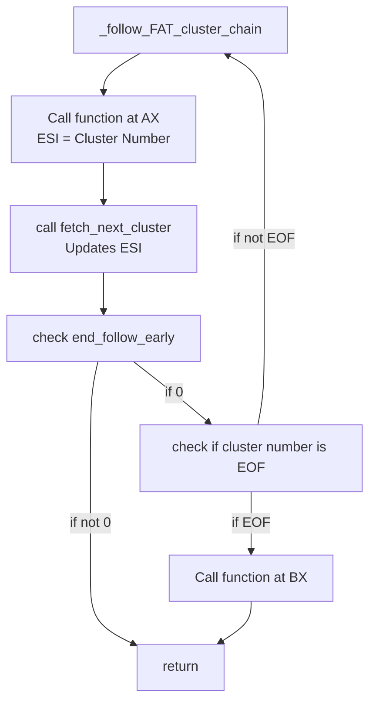

```mermaid
flowchart TD
    start[_follow_FAT_cluster_chain]
    func[
        Call function at AX
        ESI = Cluster Number
    ]
    fetch[call fetch_next_cluster
        Updates ESI
    ]
    check_end_early[check end_follow_early]
    check_end_clusters[check if cluster number is EOF]
    endfunc[Call function at BX]

    return[return]

    start --> func
    func --> fetch
    fetch --> check_end_early
    check_end_early --> |if not 0| return
    check_end_early --> |if 0| check_end_clusters
    check_end_clusters --> |if not EOF| start
    check_end_clusters --> |if EOF| endfunc
    endfunc --> return
```