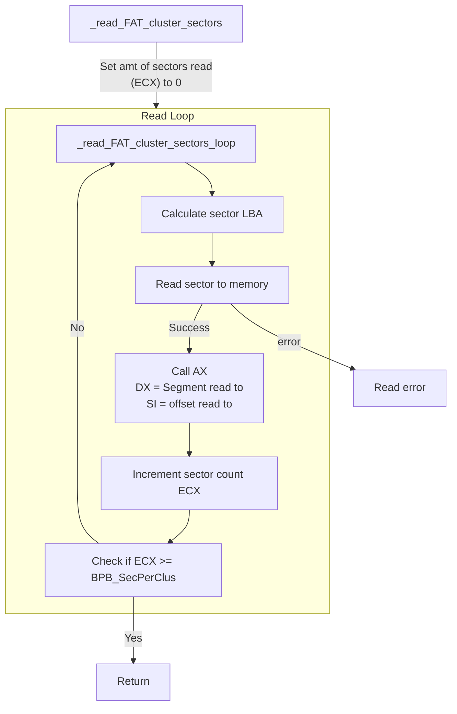

```mermaid
flowchart TD
    start[_read_FAT_cluster_sectors]

    readerr[Read error]

    return[Return]

    subgraph readloop [Read Loop]
        loop[_read_FAT_cluster_sectors_loop]
        calc[Calculate sector LBA]
        read[Read sector to memory]
        func[Call AX
        DX = Segment read to
        SI = offset read to]
        inc[Increment sector count ECX]
        checkCount[Check if ECX >= BPB_SecPerClus]
        
        loop --> calc
        calc --> read
        read --> |Success| func
        func --> inc
        inc --> checkCount
        checkCount -->|No| loop
    end
    
    read -->|error| readerr
    checkCount -->|Yes| return


    start -- Set amt of sectors read 
    (ECX) to 0 --> readloop
```